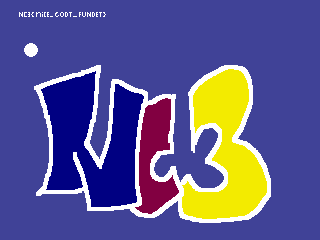
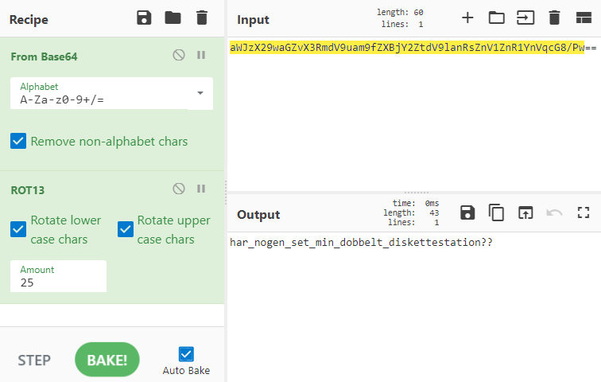
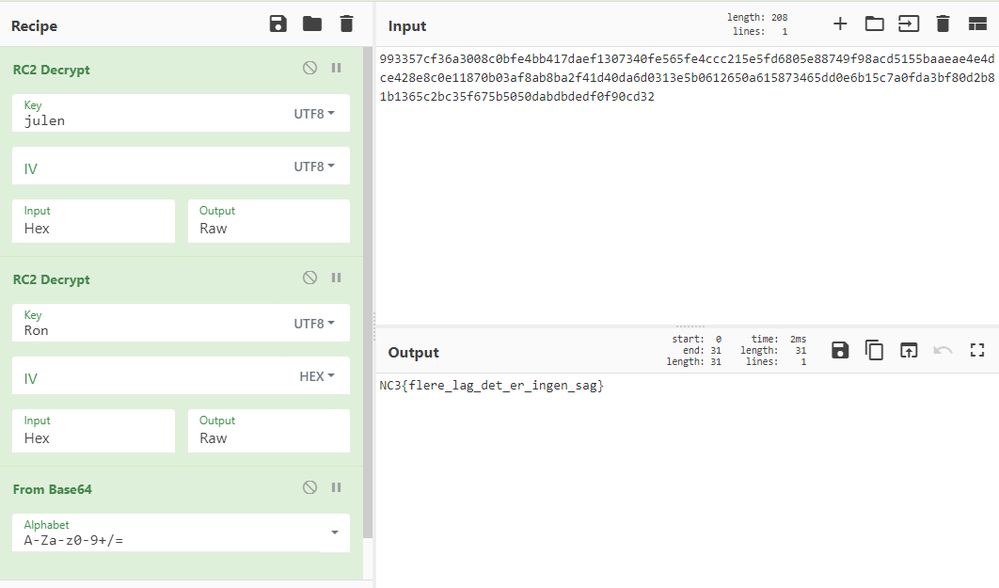
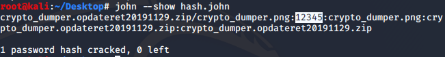
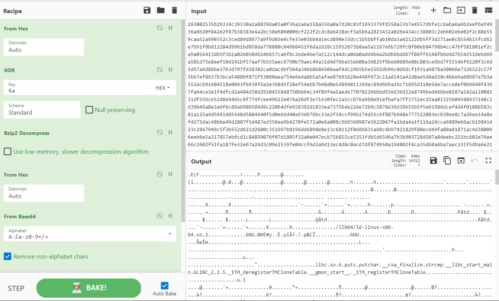
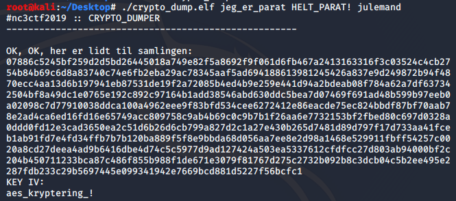
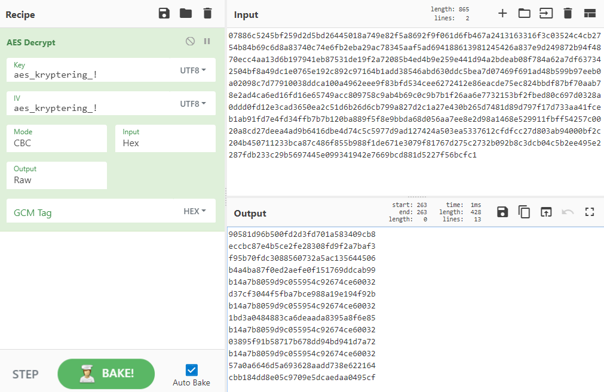

[Back](README.md)

## CTF 10 p - alle_kan_være_med

Given a file with an explanation, we're tasked to find a flag in the following text

Text: `3CN{gej_re_dem}`

Simply read explanation, look at the flag and arrange the letters.

Flag: ``NC3{jeg_er_med}``

---

## CTF 25 p - skru_op!!

I can honestly not remember which of the flags was the correct.

Zooming in at the image you were presented with a flag, which probably not was the correct one?



Running a utility like **strings** just to go deeper

```html
strings -n 6 skru_op.png
```

Reveals another flag: *NC3{en_fil_kan_gemme_paa_mange_pakker}*

---

## CTF 50 p - Gæt Et Format

Use your favorite base64 decoder

Example:

```html
echo 'TkMze2Rlcl9rYW5fYnJ1Z2VzX21hbmdlX2ZvcnNrZWxsaWdlX2Zvcm1hdGVyfQ==' | base64 -d
```

Flag: *NC3{der_kan_bruges_mange_forskellige_formater}*

---

## CTF 70 p - enplusfiretreds

Open file provided like any other text file

This kinda looks like a flag, but theres something off...

```html
NC3{aWJzX29waGZvX3RmdV9uam9fZXBjY2ZtdV9lanRsZnV1ZnR1YnVqcG8/Pw==}
```

The content looks like its base64 encoded

But after decoding it still looks like gibberish

```html
ibs_ophfo_tfu_njo_epccfmu_ejtlfuuftubujpo??
```

Taking a closer look something is left untouched, the _ and ??, only the letters of the alphabet have been affected by the cipher used.
And indicated by the challenges hashtags: #ctf #klassisk

we're dealing with a shift cipher.

Using Cyberchef here to deal with chaining base64 and rot25


Flag: *NC3{har_nogen_set_min_dobbelt_diskettestation??}*

---

## CTF 75 p - Onion

The name reveals we're gonna be going some layers down the hole to find the flag

It also speaks of this guy called Ron and the quote is conveniently from 1987, putting ```"Ron 1987"``` in google or just searching ```"ron"``` in cyberchef quickly reveals we're going to be using RC2 designed by Ron Rivest in 1987.

Using RC2 and decrypting using the hints from the file, multiple "keys" are suggested here and "Ron og Julen" are heavily hinted.

First layer can be decrypted with the key ```"julen"```, after decrypting once it returns more hex, lets try RC2 again.

Second layer can be decrypted with the key ```"ron"```

Third layer seems to be base64 string which can be decoded

Example using cyberchef


Flag: *NC3{flere_lag_det_er_ingen_sag}*

---

## CTF 125 - Hardcore Crypto!!

Provided file includes something that looks like a base64 string, but decoding returns gibberish.

Taking a closer look at whats hinted: *13 steps forward and 13 backwards*

This hints at something to do with a shift cipher, but just using this won't return anything useful right now.

But then again NC3 just loves Gulddrengen so ```"guldjul"``` must be a key somewhere, and the year 1500 theres was a cipher created which might just be what we need to use: Vigenere cipher.

Decoding with Vigenere cipher and key ```"guldjul"```, we get base64 which can be decoded.

```html
AP3{pelcgb_re_gbgny_frwg__aåe_qrg_oehtrf_evtgvtg}
```

Looks like shift cipher, trying rot13 reveals correct flag.

flag: *NC3{crypto_er_total_sejt__når_det_bruges_rigtigt}*

---

## CTF 250 - crypto_dumper

zip provided was password protected, guessing game or just crack it

```html
zip2john crypto_dumper.opdateret20191129.zip > zip.hash
john --wordlist=/usr/share/wordlists/metasploit/password.lst zip.hash
```


password: 12345

Here i just used cyberchefs "magic" tool to give me a hint of what could've been done here.

It suggested XOR with key ```"6a"``` to get a bzip archive, well followed by decompressing this archive, reveals hex... from hex we get some base64 and finally after decoding the base64, we get an elf binary.


quickly inspecting in IDA Free reveals we can just run it and provide the three strings found, and we should get something in return.


Here we get something which we should decrypt using AES, with ```"aes_kryptering_!"``` as both KEY and IV.

Looks like we got some md5 hashes in return, looked up these hashes at <https://crackstation.net/>

```html
90581d96b500fd2d3fd701a583409cb8 NC
eccbc87e4b5ce2fe28308fd9f2a7baf3 3
f95b70fdc3088560732a5ac135644506 {
b4a4ba87f0ed2aefe0f151769ddcab99 DET
b14a7b8059d9c055954c92674ce60032 _
d37cf3044f5fba7bce988a19e194f92b HER
b14a7b8059d9c055954c92674ce60032 _
1bd3a0484883ca6deaada8395a8f6e85 ER
b14a7b8059d9c055954c92674ce60032 _
03895f91b58717b678dd94bd941d7a72 DA
b14a7b8059d9c055954c92674ce60032 _
57a0a6646d5a693628aadd738e622164 NEMT
cbb184dd8e05c9709e5dcaedaa0495cf }
```

Flag: *NC3{DET_HER_ER_DA_NEMT}*

---

## CTF 350 - Easy Pass

Opening the provided html reveals a hint ```"Favorite Developer"```

Inspecting the html and scrolling all the way to the bottom you can find:

```html
<!--Page created by SantaTheDev -->
```

Using ``"SantaTheDev"`` as password unlocks the password manager.

Next we can explore page. What caught my attention was the untitled tab with note as username, this password looks like base64 but it doesn't have any `l,I,0,O` in it, but trying other base encodings was the thing to do.

```css
FL12bCLm7HTNCqyFon48AfobKr
```

Base58 decoded the string:

Flag: *NC3{En_lille_nisse}*

---

[Back](README.md)
