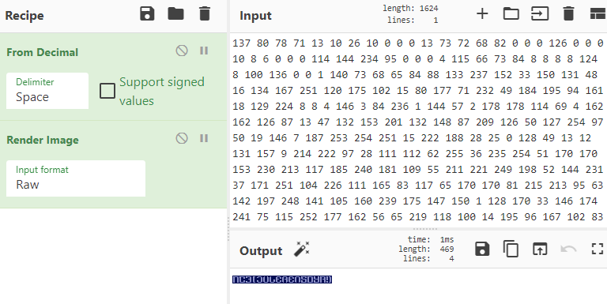
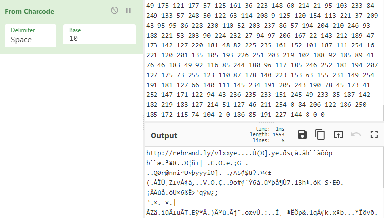
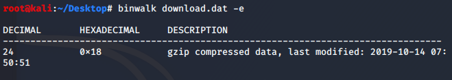
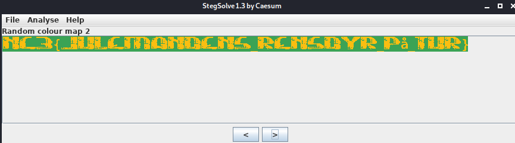

[Back](README.md)

## Forensic 100 - rudolf

Provided is a file with loads of numbers in it.

These are just decimals and after converting from decimals to raw, it reveals a PNG header so we try to render the image.



Flag: *NC3{JULERENSDYR!}*

---

## Forensic 200 - Zip-Mareridt!!!

Warning doing this challenge will extract more than 1 GB to your system.

This challenge is basically a "extract loop" challenge, with a tiny twist.
At some point during extraction, a hint drops out, to target a specific zip file.
This i just added whenever the code reaches a exception.

Following code will extract zip until theres no left.

```python
#!/usr/bin/python3
from zipfile import ZipFile

def getArchiveName(zip_file):
    with ZipFile(zip_file, "r") as f:
        names = f.namelist()

    return str(names[0])

def unzipArchives(zip_file):
    with ZipFile(zip_file) as archive:
        archive.extractall()

def extract(file):
    zip_file = file
    while True:
        print("[+]Extracting {0}".format(zip_file))
        unzipArchives(zip_file)
        zip_file = getArchiveName(zip_file)

def main():
    try:
        extract("zip_mareridt.zip")
    except:
        try:
            extract("49c86cecf65cf1b793c914661026e240.zip")
        except:
            print(open("flag.txt", "r", encoding="utf8").read())


if __name__ == "__main__":
    main()

```

Flag: NC3{godt_det_er_overstået}

---

## Forensic 350 - indrammet_julemand

Again provided file are just decimals after conversion we're left with alot of data.


The rebrand link is just an easter egg, rick can be found every year.

I went straight into using `binwalk` to examine the file:



after inspecting the image `binwalk` extracted.
It was a classic `stegsolve` opportunity:



Flag: *NC3{JULEMANDENS_RENSDYR_PÅ_TUR}*

---

[Back](README.md)
