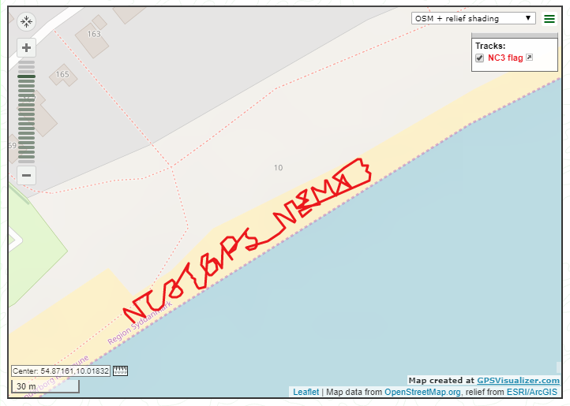
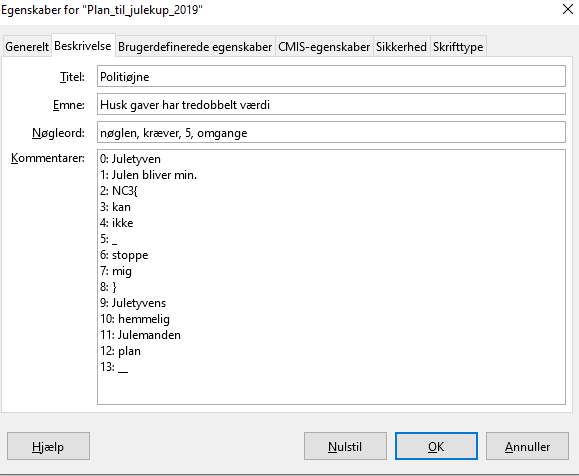

[Back](README.md)

## misc 75 - En lille tur

Using [GPS Visualizer](https://www.gpsvisualizer.com/) we can upload the file we get and see a map with the flag on.



Flag: *NC3{GPS_NEMT}*

---

## misc 175 - Stop juletyven

Opening provided powerpoint in libre office, we can see the masterminds plan. There no hidden content in the slide, or macros.

Onto document properties:



Looking at this is a bit of guessing, but as we just looked at juletyvens plan, i would guess the flag is

```html
NC3{Juletyvens_plan}
```

But i don't remember if this was the correct flag.

---

[Back](README.md)
