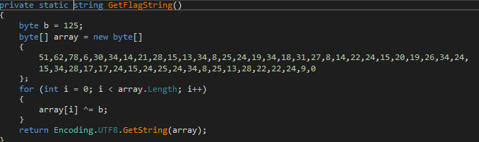

[Back](README.md)

## Reversing 75 p - C Skarp Ud

Here we're hinted to use dnSpy to look at a C# binary.

Just drag and drop the binary into the explorer of the left. From there explore the project and find the MainWindow class.

here we can find what values the sliders need


Oneway now to complete the challenge is to just run the program and change the sliders to these values.
But its also possible to just extract the method and run in an online [C# fiddle tool](https://dotnetfiddle.net/)



DotnetFiddle:

```c#
using System;
using System.Text;		
public class Program
{
 public static void Main()
 {
  Console.WriteLine(GetFlagString());
 }

  private static string GetFlagString()
  {
    byte b = 125; // the three slider values 99.0 + 25.0 + 1.0
    byte[] array = new byte[]
    {
     51,62,78,6,30,34,14,21,28,15,13,
     34,8,25,24,19,34,18,31,27,8,14,22,
     24,15,20,19,26,34,24,15,34,28,17,17,
     24,15,24,25,24,34,8,25,13,28,22,22,24,9,0
    };
    for (int i = 0; i < array.Length; i++)
    {
     array[i] ^= b;
    }
    return Encoding.UTF8.GetString(array);
  }
}
```

Flag: *NC3{c_sharp_uden_obfuskering_er_allerede_udpakket}*

---

## Reversing 100 p - crackme_241219

Here I chose to use IDA Free to open the binary. I went straight into strings view to see where interesting strings are used. This lead me into the entry point for this program.


From just looking it seems like a loop that checks each character in the argument you provide the program.
Simply by taking the hex value that the `cmp byte ptr` is comparing against. Here IDA shows us whats the value are each step:

```hex
61 6c 6c 65 5f 65 6c 73 6b 65 72 5f 6a 75 6c 65 6e
```

From hex to utf8

```html
alle_elsker_julen
```

Flag: *NC3{alle_elsker_julen}*

---

## Reversing 350 p - SHeLLK0D3

This challenge title hints that we're somehow going to be working with shellcode...

in the provided file theres alot of Hex value, but this doesn't produce anything printable. But we can disassemble this into x86.


There's alot of data getting pushed onto the stack and then XOR'd with hex `"02030203"`

Reproducing this in cyberchef:


Flag: *NC3{x86_i_en_nøddeskal}*

---

[Back](README.md)
